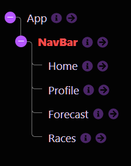

# Weather Apparel App

## Introduction

Our application is intended to assist users who are interested in knowing what the proper apparel would be to wear outside given the current weather conditions according to their location and/or type of activity. 

## User Stories

### A user will be able to...

See what they can wear based off of:

**Temperature**
**Humidity**
**Wind**
**Precipitation**

### Post Requirement

A user will be able to input their name to create an account

### Patch Requirement

A user will be able to add cities to a rendered card list on the home page and view their weather conditions

## Wireframe

## Learning Goals

[ ] - Build a React single page application from scratch
 
[ ] - Apply your knowledge of components, props and state management
 
[ ] - Incorporate client-side routing
 
[ ] - Use data from an API

## Requirements

### Immediate Requirements

[ ] - Create GitHub repos, add all of your group members as contributors to the project, and create a 1-2 sentence pitch about your project.
 
[ ] - Create a list of user stories, this is just a statement about what your app will do.
 
[ ] - Create some wireframes for your web page.
 

### Secondary Requirements

[ ] - You must make a single page application (only one index.html file) using create-react-app.
 
[ ] - Your app should use at least 5 components in a way that keeps your code well organized.
 
[ ] - There should be at least **3 client-side routes** using React Router (Links to an external site.). Be sure to include a **nav bar** or other UI element that allows users to navigate between routes.
 
[ ] - Use a json-server to create a RESTful API for your backend and make both a GET and a POST request to the json server.
  
[ ] - Use a form to make your post request, specifically a controlled form/component. Additionally, you may choose to incorporate data from an external API but it is not required.
 
[ ] - Add some styling: you're encouraged to write your CSS from scratch, either by using styled components or writing CSS files and using id/className to style your elements. 
