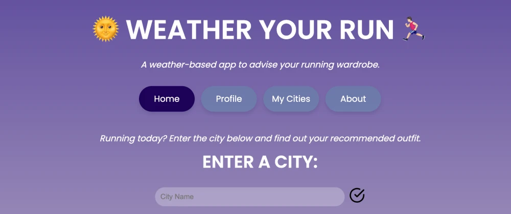
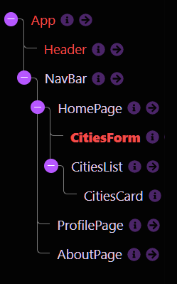
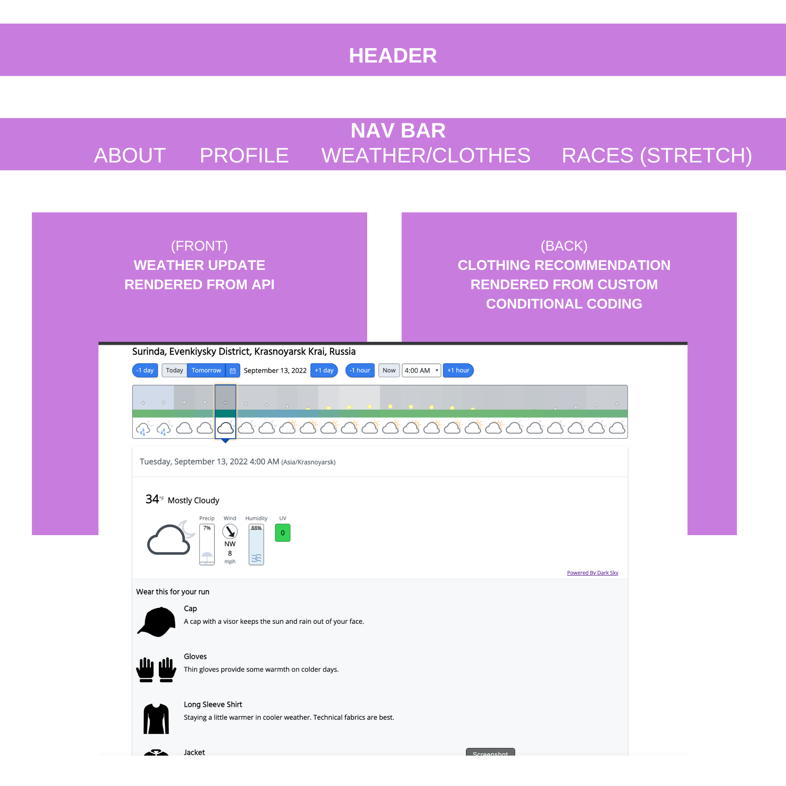

# WEATHER YOUR RUN

Table of Contents
- [MOTIVATION](#motivation)
- [TECH STACK](#tech-stack)
- [USAGE & FEATURES](#usage-&-features)
- [FUTURE PLANS] (#future-plans)
- [Agile Workflow](#project-board)
- [MAINTAINERS](#maintainers)

## MOTIVATION
Our application is intended to assist users who are interested in knowing the proper apparel to wear outside given the current weather conditions according to their location and/or route of activity.
## TECH STACK
- External API
- 
- 
## USAGE & FEATURES

 A user will be able to...

#### 1. See what they can wear based off of: Temperature, Humidity, Wind, and Precipitation

#### 2. Refresh the page to see updated weather data without the input form opening up again

#### 3. Input their name and details to create an account (Post Requirement)

#### 4. Add cities to a rendered card list on the home page and view their weather conditions (Patch Requirement)

### Wireframe

### Learning Goals

[ ] - Build a React single page application from scratch
 
[ ] - Apply your knowledge of components, props and state management
 
[ ] - Incorporate client-side routing
 
[ ] - Use data from an API

### Requirements

### Secondary Requirements

[ ] - You must make a single page application (only one index.html file) using create-react-app.
 
[ ] - Your app should use at least 5 components in a way that keeps your code well organized.
 
[ ] - There should be at least **3 client-side routes** using React Router (Links to an external site.). Be sure to include a **nav bar** or other UI element that allows users to navigate between routes.
 
[ ] - Use a json-server to create a RESTful API for your backend and make both a GET and a POST request to the json server.
 
[ ] - Use a form to make your post request, specifically a controlled form/component. Additionally, you may choose to incorporate data from an external API but it is not required.
 
[ ] - Add some styling: you're encouraged to write your CSS from scratch, either by using styled components or writing CSS files and using id/className to style your elements.

### Current Workings

[ ] - get client side routing to work
 
[ ] - create input form on forecast page that takes in location data
 
[ ] - create input form for profile page that takes in user data
 
[ ] - create cards for homepage and way of patching watchlist cities

## FUTURE PLANS

## MAINTAINERS

- Rachel Mullen: https://www.linkedin.com/in/racheljmullen/
- Shelby Lee: https://www.linkedin.com/in/shelby-lee-slee/
- Nessa Kodo: https://www.linkedin.com/in/nessakodo/

This project won an award for best use of outside tech for our cohort.

- Use an agile process to turn well defined requirements into deployed and production ready software
- Gain experience dividing applications into components and domains of responsibilities to facilitate multi-developer teams
- Explore and implement brand new frameworks/technologies (React Native, hooks)
- Practice an advanced, professional git workflow
- Gain more experience using continuous integration tools to build and automate the deployment of features in various environments
- Build applications that execute in development, test, CI, and production environments
- Focus on communication between front end and back end teams in order to complete and deploy features

Over 120 tickets (user stories, bugs, new feature and testing tickets) were converted into issues, and tracked by the entire team throughout the four week build.
